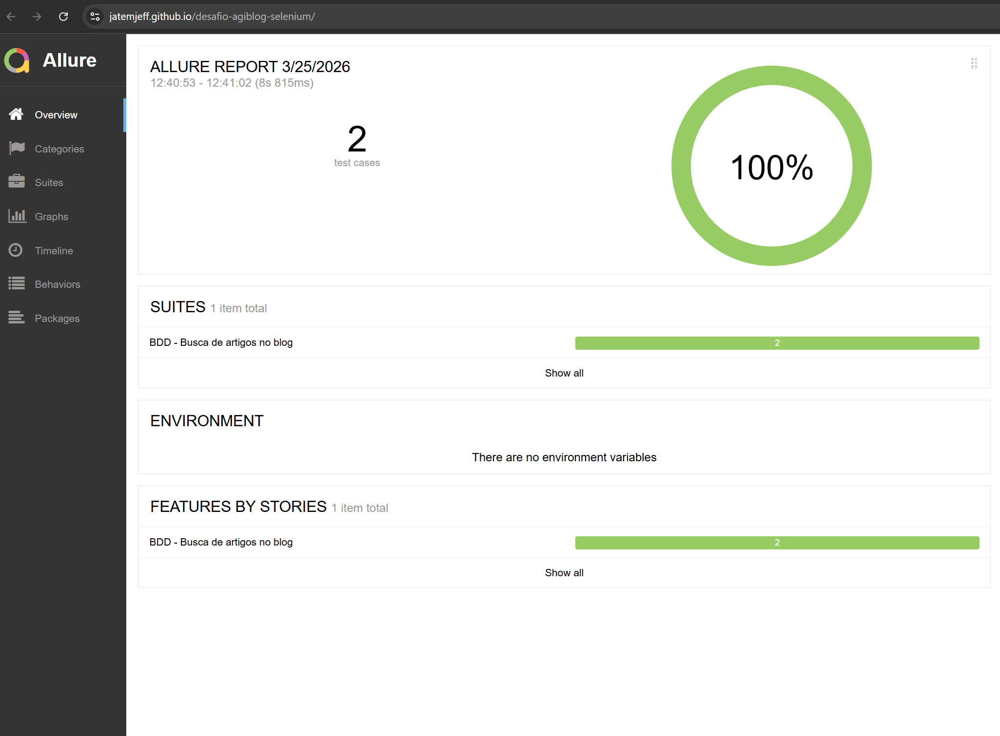

# 🧪 Agi Blog UI Test Automation (Selenium + Cucumber + CI/CD)


Projeto de automação de testes E2E para o site [Blog do Agi](https://blogdoagi.com.br/), utilizando **Java + Selenium WebDriver + Cucumber (BDD)**, com foco em boas práticas, arquitetura limpa e integração contínua.

---

## 🚀 Tecnologias utilizadas

* ☕ Java 21
* 🧪 Selenium WebDriver
* 🥒 Cucumber (BDD)
* 🧩 JUnit 5
* ⚙️ Maven
* 📊 Allure Reports
* 🔄 GitHub Actions (CI/CD)
* 🌐 GitHub Pages (publicação de relatório)

---

## 📁 Estrutura do projeto

```bash
src
├── main
│   └── java
│       └── com.jeff.agiblog
│           ├── driver
│           │   ├── DriverFactory.java
│           │   └── DriverContext.java
│           └── pages
│               ├── BasePage.java
│               ├── HomePage.java
│               └── ResultsPage.java
│
├── test
│   ├── java
│   │   └── com.jeff.agiblog
│   │       ├── bdd
│   │       │   ├── hooks
│   │       │   │   └── Hooks.java
│   │       │   ├── steps
│   │       │   │   └── SearchSteps.java
│   │       │   └── runner
│   │       │       └── RunCucumberTest.java
│   │       └── tests
│   │           └── BaseTest.java
│   │
│   └── resources
│       └── features
│           └── Search.feature
```

---

## 🧠 Estratégia de testes

Os testes cobrem o fluxo de busca de artigos no blog:

### ✔ Cenários automatizados

* 🔎 Busca por artigo válido
* ❌ Busca por artigo inválido (não existente)

### ✔ Validações

* Presença de resultados ou não

---

## ▶️ Como executar o projeto

### 🔹 Pré-requisitos

* Java 21
* Maven 3.9+
* Chrome instalado

---

### 🔹 Executar os testes

```bash
mvn clean test
```

---

### 🔹 Executar por tag

```bash
mvn clean test -Dcucumber.filter.tags="@search-valid-article"
```

---

## 📊 Relatório de testes (Allure)

Após a execução:

```bash
mvn allure:report
```

Para visualizar localmente:

```bash
mvn allure:serve
```

---

## 🌐 Relatório publicado

# 👉 Acesse o relatório online:
* https://jatejeff.github.io/desafio-agiblog-selenium/




---

## 🔄 Integração contínua (CI/CD)

Pipeline configurada com GitHub Actions:

✔ Execução automática a cada push
✔ Execução dos testes E2E
✔ Geração de relatório Allure
✔ Publicação automática no GitHub Pages

---

## ⚙️ Boas práticas aplicadas

* ✔ Page Object Model (POM)
* ✔ Separação de responsabilidades
* ✔ Driver centralizado (DriverFactory + Context)
* ✔ Uso de waits explícitos (WebDriverWait)
* ✔ Testes desacoplados da UI dinâmica
* ✔ Execução headless no CI
* ✔ Pipeline CI/CD completa

---

## 🧠 Aprendizados e desafios

* Manipulação de elementos dinâmicos e múltiplos inputs no DOM
* Sincronização de testes em ambiente headless
* Diferenças de comportamento entre execução local e CI
* Estruturação de testes BDD escaláveis
* Publicação automatizada de relatórios

---

## 👨‍💻 Autor

Jefferson França
🔗 https://www.linkedin.com/in/jefffranca/


